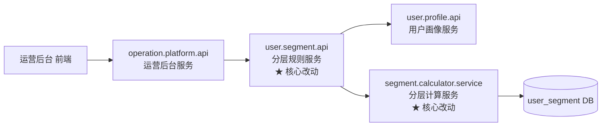
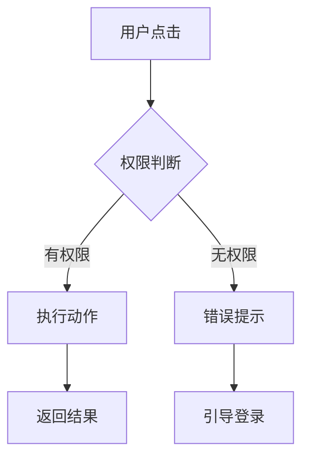
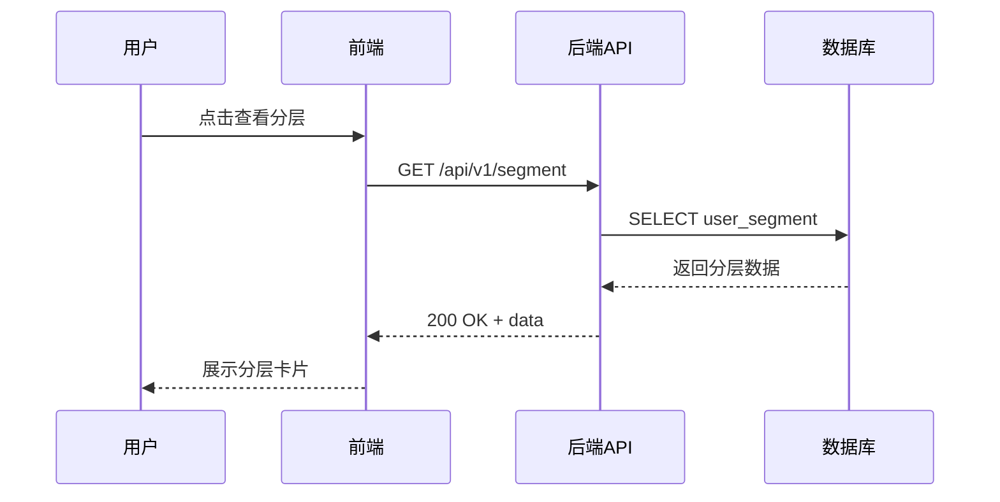

# E2E Architecture Draw —— 架构图绘制

## 定位

把**文字描述的架构**变成**飞书白板上的可视化图**，让非研发同学也能理解。

**本 skill 的输出是飞书白板文档**（可分享、可协作）。

---

## 何时调用

### 主动触发时机

主 Agent 应在以下场景主动调用：

1. **`e2e-codebase-mapping` 完成后**：把"调用链图"画到白板
2. **PRD 包含架构设计时**：把架构图画出来附到 PRD
3. **跨团队讨论时**：用白板作为对齐工具
4. **话题归档总结时**：把最终架构图放入总结

### 用户主动触发

- "画个架构图"
- "可视化一下这个流程"
- "让 PM 看看代码结构"

---

## 支持的图类型

| 图类型 | 适用场景 | 源码格式 |
|---|---|---|
| **服务调用链** | 多服务间的调用关系 | Mermaid `graph LR` |
| **时序图** | 接口调用的时序 | Mermaid `sequenceDiagram` |
| **流程图** | 业务流程、用户流程 | Mermaid `flowchart TD` |
| **ER 图** | 数据模型关系 | Mermaid `erDiagram` 或 PlantUML |
| **类图** | 代码结构 | PlantUML |
| **状态图** | 状态机 | Mermaid `stateDiagram` |

**MVP 优先 Mermaid**（飞书白板原生支持好），PlantUML 作为补充。

---

## 核心工作流

```
输入：架构描述（可能是文字、可能是已有的 mermaid）
   │
   ▼
┌────────────────────────────────────────┐
│ 步骤 1：生成图源码                       │
│ - 根据描述生成 Mermaid                  │
│ - 或直接用用户提供的 Mermaid            │
└──────────────────┬─────────────────────┘
                   │
                   ▼
┌────────────────────────────────────────┐
│ 步骤 2：生成前预览（文本）               │
│ 展示 Mermaid 源码给用户看               │
│ 让用户确认再上传到飞书                  │
└──────────────────┬─────────────────────┘
                   │
                   ▼
┌────────────────────────────────────────┐
│ 步骤 3：上传到飞书白板                   │
│ 调 feishu-cli-board 导入 Mermaid       │
└──────────────────┬─────────────────────┘
                   │
                   ▼
┌────────────────────────────────────────┐
│ 步骤 4：返回白板链接                     │
│ 可分享到话题、或关联到 PRD              │
└────────────────────────────────────────┘
```

---

## Mermaid 生成的风格规范

### 服务调用链图

**推荐格式**（来自 `skill-orchestration-map.md` 风格）：



**关键规范**：

- 节点显示**业务名 + PSM**（两行用 `<br/>` 分隔）
- 核心改动用 `★` 标记
- DB 用圆柱形 `[(...)]`
- 外部系统/用户用双圆 `(((...)))`

### 用户流程图

**推荐格式**：



**关键规范**：

- 决策点用菱形 `{...}`
- 正常流程和错误流程都要画出来
- 箭头标注触发条件

### 时序图



**关键规范**：

- 从上到下时间顺序
- 实线箭头 `->>` 是请求
- 虚线箭头 `-->>` 是响应
- 关键业务异常用 `Note` 标注

---

## 与用户的交互

### 步骤 2 预览的重要性

**不要**生成图就直接上传飞书。**必须**先给用户看 Mermaid 源码：

```
我准备画一个服务调用链图，Mermaid 源码如下：

[贴 Mermaid 源码]

渲染预览：
[如果 Agent 能渲染 Mermaid，展示；否则文字描述]

如果 OK，我就调 feishu-cli-board 上传到飞书白板。
如果需要调整，告诉我（比如"加上 Redis"、"改成中文节点名"）。
```

用户确认后再上传。

---

## 调用 feishu-cli-board

```
让 feishu-cli-board skill 创建飞书白板：
- 标题：[架构图标题]
- 内容：Mermaid 源码
- 导入格式：mermaid
```

`feishu-cli-board` 会：

- 创建一个白板文档
- 把 Mermaid 源码导入为飞书白板的可视化组件
- 返回白板 URL

**不要**自己调飞书 OpenAPI，让 `feishu-cli-board` 处理。

---

## 返回给用户

上传成功后：

```markdown
# 架构图已生成

📌 **飞书白板**：https://bytedance.feishu.cn/wiki/xxx

**图类型**：服务调用链图
**涉及服务数**：5 个
**创建时间**：2026-04-19 16:00

## 下一步建议
- 可以在白板上直接评论或标注
- 可以分享给 PM/QA 协作
- 可以嵌入到 PRD 文档（通过 feishu-cli-import）
```

---

## 和其他 skill 的协同

### 输入来自

- `e2e-codebase-mapping` —— 调用链数据
- `prd-generation` —— PRD 里需要附图的章节

### 输出给

- `e2e-progress-notify` —— 把白板链接通知给相关人
- `e2e-prd-share` —— 把图作为 PRD 的一部分

---

## 失败处理

### 失败 A：Mermaid 源码有语法错误

- 在步骤 2 预览时就应该发现
- 用户反馈 → Agent 修复
- 修复不了 → 降级为 PlantUML 或文字描述

### 失败 B：飞书白板 API 不支持 Mermaid 导入

- 降级方案：先生成 PNG 图片（用公开 Mermaid 渲染器）
- 上传到飞书为图片
- 告知用户"这是图片，不能直接编辑"

### 失败 C：飞书认证过期

- 调 `feishu-cli-auth` 重新登录
- 重试

---

## 反 AI-slop 规范

### 禁用模式

- ❌ 画很花哨但没信息量的图（比如装饰性的边框、颜色）
- ❌ 关键节点省略（"因为太多画不下"）
- ❌ 箭头方向错误
- ❌ 用图片替代本可用 Mermaid 表达的（失去可编辑性）

### 正确模式

- ✅ 每个节点都有明确语义
- ✅ 箭头方向正确（调用方向 / 数据方向 / 时间顺序）
- ✅ 关键改动点突出标记
- ✅ 用 Mermaid（可编辑）而非静态图片

---

## 参考资料

- `references/openclaw-tools.md` —— OpenClaw 下调用 feishu-cli-board
- `references/trae-tools.md` —— Trae 下的替代方案（可能本地渲染 Mermaid）

---

## 自检清单

- [ ] 图类型是否匹配场景（调用链 / 时序 / 流程 / ER）？
- [ ] 节点命名是否清晰（含 PSM、业务含义）？
- [ ] 关键改动点是否标记？
- [ ] Mermaid 源码是否给用户预览确认过？
- [ ] 白板链接是否能正常打开？

---

*本 skill 的价值：**让架构可视化、可协作、可编辑**。白板不只是截图，是活的设计文档。*
