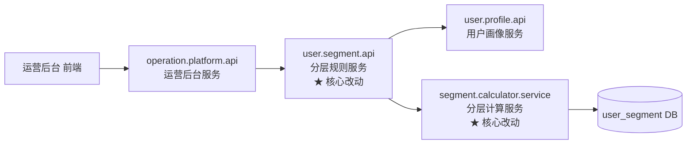

# E2E Codebase Mapping —— 跨仓代码映射（brownfield）

## 定位

本 skill 是端到端交付主流程的**阶段 3 的 brownfield 分支**：从 PRD 到方案设计的前置素材。

**仅用于存量项目**。新项目(greenfield)不走本 skill，改走 `e2e-web-search` + `bytedance-cloud-docs` 做轻量调研。

**输入**：定稿的 PRD（来自 `prd-generation`）
**输出**：`CODEBASE-MAPPING.md`（工作目录根），含改动点清单 + 调用链图 + 风险点

**本 skill 只读不写**（对代码仓库而言）。没有 HARD-GATE（不产生副作用）。

**下游**：产出的 CODEBASE-MAPPING.md 作为 `e2e-solution-design` 生成 plan.md 的前置素材（不是直接给 code-review-loop 用）。

---

## 前置条件

进入本 skill 前，必须：

- [x] PRD 已定稿（`prd-generation` 已触发 HARD-GATE）
- [x] `bytedance-auth` 已登录（否则调用字节内部 skill 会失败）

缺失认证 → 先调用 `bytedance-auth login`。

---

## 核心工作流

```
输入 PRD
   │
   ▼
┌──────────────────────────────────────┐
│ 步骤 1：识别业务域                   │
│ 从 PRD 提取关键业务词                │
│ → 例：订单、用户分层、通知           │
└──────────────────┬───────────────────┘
                   │
                   ▼
┌──────────────────────────────────────┐
│ 步骤 2：搜仓库（bytedance-codebase） │
│ 按业务词搜匹配的代码仓库             │
│ 列出：仓库名、主要语言、owner        │
└──────────────────┬───────────────────┘
                   │
                   ▼
┌──────────────────────────────────────┐
│ 步骤 3：识别服务（bytedance-bam）    │
│ 查这些仓库对应的 PSM 服务            │
│ 查服务暴露的 Method / IDL            │
└──────────────────┬───────────────────┘
                   │
                   ▼
┌──────────────────────────────────────┐
│ 步骤 4：深入改动点                   │
│ 对每个涉及仓库，定位需要改的具体文件 │
│ （读关键文件、看目录结构）           │
└──────────────────┬───────────────────┘
                   │
                   ▼
┌──────────────────────────────────────┐
│ 步骤 5：梳理调用链                   │
│ 画出服务之间的调用关系               │
│ 识别改动的传播路径                   │
└──────────────────┬───────────────────┘
                   │
                   ▼
┌──────────────────────────────────────┐
│ 步骤 6：识别风险点                   │
│ 数据兼容 / 性能热点 / 稳定性影响     │
└──────────────────┬───────────────────┘
                   │
                   ▼
产出：Markdown 格式的改动点清单
```

---

## 步骤详解

### 步骤 1：识别业务域

从 PRD 提取关键词。方法：

- 看 PRD 的"一句话说明"
- 看 Must 清单的动词 + 名词
- 看"涉及模块 / 系统"章节

**产出**：3-10 个业务关键词。

示例：
```
PRD 摘录：
"给运营同学一个自助配置用户分层规则的后台..."

提取关键词：
- 用户分层 (user-segment)
- 运营后台 (operation-platform)
- 规则引擎 (rule-engine)
- 用户画像 (user-profile)
```

### 步骤 2：搜仓库

**调用 `bytedance-codebase`**：

```
让 bytedance-codebase skill 对每个关键词搜仓库。
不要自己拼 bytedcli 命令，让 skill 处理。
```

**搜索策略**：
- 先搜业务词（`用户分层`、`user-segment`）
- 再搜服务模式（`*-api`、`*-service`）
- 最后搜特定实现（如 `rule-engine`、`segment-calculator`）

**筛选**：对每个搜到的仓库判断"真相关 vs 假相关"：
- ✅ 真相关：仓库名、README 明显对应
- ❌ 假相关：名字撞上但业务不同（过滤掉）

### 步骤 3：识别服务

对每个真相关仓库，**调用 `bytedance-bam`** 查对应的 PSM 服务：

```
让 bytedance-bam skill 按仓库或 PSM 名查服务详情：
- 服务暴露的 Method 列表
- 每个 Method 的 IDL 定义
- 上下游依赖（如果 BAM 平台有记录）
```

**产出**：服务清单 + 每个服务的关键接口。

### 步骤 4：深入改动点

这是最需要判断力的一步。对每个涉及仓库：

1. **调用 `bytedance-codebase`** 读关键文件（如 `handler/`、`service/`、`model/`）
2. 基于 PRD 的 Must 清单，判断哪些文件需要改
3. 对复杂改动，标注**改动方式**：
   - `NEW`：新增文件
   - `MODIFY`：修改现有文件
   - `REFACTOR`：需要重构（改动范围大）

**判断标准**：

- 涉及接口变更 → 找 `*_api.go` / `*_handler.go`
- 涉及业务逻辑 → 找 `service/`、`biz/`
- 涉及数据模型 → 找 `model/`、`dao/`、IDL 文件
- 涉及配置 → 找 `config/`、`settings/`

### 步骤 5：梳理调用链

用 Mermaid 画出服务调用关系。**上游 → 下游**方向。

**示例输出**：



**标注规范**：
- `★` 标记核心改动
- `◇` 标记受影响（需要联调但不改代码）
- 箭头粗细表示调用频率

### 步骤 6：识别风险点

风险分 4 类：

#### 风险类别 A：数据兼容

- 是否涉及 DB schema 变更？→ 需要迁移方案
- 是否涉及 IDL 字段增删？→ 上下游兼容性
- 是否涉及缓存 key 结构变更？→ 缓存穿透/刷缓存

#### 风险类别 B：性能热点

- 改动的接口是否是高 QPS 接口？（调 `bytedance-apm` 查 QPS）
- 是否涉及循环查询、N+1 问题？
- 是否涉及大范围的数据计算？

#### 风险类别 C：稳定性

- 改动是否在核心交易链路？
- 是否影响降级逻辑？
- 是否影响监控告警？

#### 风险类别 D：跨团队依赖

- 涉及的仓库是否有多个 owner？
- 是否需要下游服务配合改 IDL？
- 是否涉及非本部门的服务？

---

## 产出物格式

最终产出一份 Markdown，固定命名 `CODEBASE-MAPPING.md`（工作目录根）：

```markdown
# 跨仓代码映射：[需求名称]

> 来源 PRD：[PRD 文件路径]
> 生成时间：[日期]
> 覆盖业务域：[关键词列表]

---

## 一、涉及仓库概览

| 仓库 | PSM | 改动级别 | Owner |
|---|---|---|---|
| `xxx-api` | `user.segment.api` | ★ 核心改动 | @张三 |
| `yyy-service` | `segment.calculator.service` | ★ 核心改动 | @李四 |
| `zzz-frontend` | `operation.platform.web` | ◇ 受影响 | @王五 |

---

## 二、每个仓库的改动点

### 2.1 `xxx-api` (user.segment.api)

**仓库地址**：[codebase URL]
**Owner**：@张三
**改动级别**：★ 核心改动

**改动文件**：
- `NEW` `handler/segment_rule_handler.go` - 新增规则 CRUD Handler
- `MODIFY` `service/segment_service.go` - 新增规则校验逻辑
- `MODIFY` `idl/segment.thrift` - 新增 RuleConfig 结构
- `NEW` `dao/segment_rule_dao.go` - 新增规则存储 DAO

**改动原因**：
基于 PRD 的 M1/M2，需要提供规则 CRUD 接口并在保存时做语法校验。

**关键接口变化**：
- 新增：`CreateSegmentRule(req)`、`UpdateSegmentRule(req)`、`DeleteSegmentRule(req)`
- 修改：无

---

### 2.2 `yyy-service` (segment.calculator.service)
[同上结构]

---

### 2.3 `zzz-frontend` (operation.platform.web)
[同上结构]

---

## 三、调用链图

[Mermaid 图]

---

## 四、数据流

[数据流图或描述]

---

## 五、风险点

### 5.1 数据兼容
- ⚠️ **需要新增 DB 表** `segment_rules`：迁移方案见附录 A
- ✅ IDL 字段只新增不修改：向后兼容

### 5.2 性能热点
- ⚠️ `segment.calculator.service` 的 `RecalculateAll` 是高耗时操作
  - 当前数据量：~1M 用户
  - 建议异步化，分批处理
  - 预估耗时：≤ 10 分钟

### 5.3 稳定性
- ✅ 不在核心交易链路
- ⚠️ 需要新增告警：分层规则保存失败率、全量重算成功率

### 5.4 跨团队依赖
- ⚠️ `operation.platform.web` 由 @王五 所在前端团队维护，需要协同排期
- ✅ 其他仓库都在本部门内

---

## 六、附录

### 附录 A：DB 迁移方案
[具体 SQL 或说明]

### 附录 B：IDL 变更详情
[IDL 字段变更清单]

### 附录 C：相关文档链接
- [PRD 链接]
- [历史讨论链接]
```

---

## 和其他 skill 的协同

### 和 `prd-generation` 的关系

- 本 skill **消费**其产出（PRD）
- 如果在分析过程中**发现 PRD 有 gap**，要回退到 `prd-generation` 补充，**不要**在本 skill 里自作主张补充

### 和 `e2e-solution-design` 的关系（重点）

- 本 skill 的产出（CODEBASE-MAPPING.md）是 `e2e-solution-design` **生成 plan.md 的前置素材**
- 改动点清单、调用链图、风险点 → 影响 plan.md 的"二、架构设计"、"四、详细设计"、"六、风险"章节
- **本 skill 不直接对接 dev-task-setup 或 code-review-loop**（它们从 task.md 读任务，不从本 skill 产出读）

### 和 `e2e-dev-task-setup` / `e2e-code-review-loop` 的关系

- **间接**：CODEBASE-MAPPING.md → plan.md → task.md → Sub-Agent 执行
- 本 skill **不直接**给这两个 skill 产出任务清单

### 和 `e2e-architecture-draw` 的关系

- 产出中的"调用链图"可以调 `e2e-architecture-draw` 发到飞书白板（非研发用户看得更直观）
- 本 skill 的调用链图会被 `e2e-solution-design` 读取并可能重绘为 plan.md 中的架构图

---

## 失败处理

### 情况 1：仓库搜不到

搜索关键词没命中任何仓库。
- 先尝试拓展关键词（同义词、英文缩写）
- 仍搜不到 → 询问用户："你知道这个功能应该在哪个业务线的哪个仓库吗？"
- 仍定位不到 → `NEEDS_CONTEXT` 返回，让用户补充

### 情况 2：涉及仓库太多（> 10 个）

- 警告用户："涉及超过 10 个仓库，这个需求可能太大了，考虑拆分"
- 建议回到 `requirement-clarification` 做子项目拆分
- 或者只针对"第一阶段"做映射

### 情况 3：关键文件读不懂

- 读了文件但语义不清
- 调 `bytedance-codebase` 看文件的 git blame、相关 issue、历史 PR
- 仍不清楚 → 标记"需要请 @owner 评审"，**不猜测**

### 情况 4：涉及外团队代码

- 明确标注"跨团队依赖"
- 建议产生"对接需求"文档单独发给对方 owner
- **不假设**对方会配合改动

---

## 反 AI-slop 规范

### 禁用模式

- ❌ 罗列所有搜到的仓库不做筛选（真相关 vs 假相关不分）
- ❌ 改动原因写"支持新功能需求"这种同义反复
- ❌ 调用链图画 N 个框但没箭头或箭头方向错
- ❌ 风险点写"需要注意性能"这种废话

### 正确模式

- ✅ 每个仓库都标明**改动级别**（★/◇/不改）
- ✅ 改动原因和 PRD 的具体 Must 条目对应
- ✅ 调用链图注明方向和频率
- ✅ 风险点给出**可执行**的应对建议（不是只描述风险）

---

## 参考资料

- `references/openclaw-tools.md` —— OpenClaw 运行时下的工具调用细节
- `references/trae-tools.md` —— Trae 运行时下的工具调用细节

---

## 自检清单（每次产出前）

- [ ] 所有"涉及仓库"都经过真/假相关筛选？
- [ ] 每个改动点有明确的改动级别？
- [ ] 调用链图方向正确？
- [ ] 风险点有**可执行**应对？
- [ ] 是否标出了跨团队依赖？
- [ ] 产出文件名为 `CODEBASE-MAPPING.md`？

---

*本 skill 是端到端交付的"现状理解"（brownfield 分支）。它的产出喂给 `e2e-solution-design` 生成 plan.md，不直接决定研发任务粒度——那是 task.md 的职责。*
