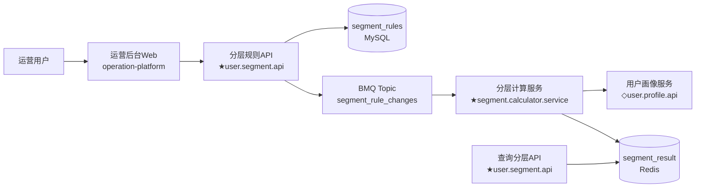
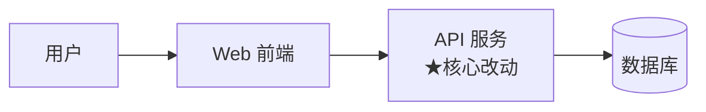
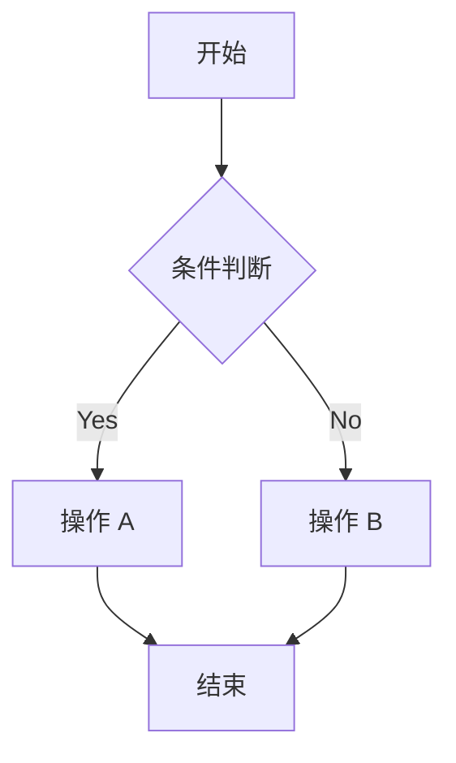
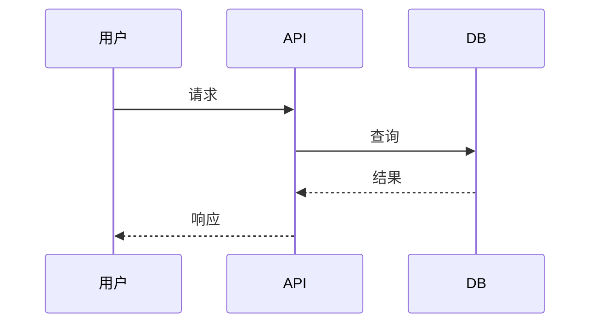
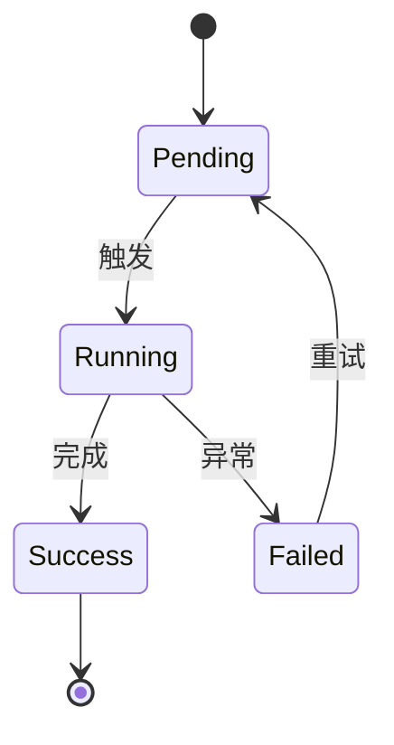

# plan.md 模板与示例

> `e2e-solution-design` 的方案文档模板。本文件提供：模板骨架 + 完整示例 + 15 项自审 Checklist。

---

## 模板骨架

```markdown
# 方案设计 · [需求名称]

> **状态**：草稿 / 定稿
> **版本**：v1.0
> **来源 PRD**：../../PRD.md
> **关联现状**：../../CODEBASE-MAPPING.md（存量）或 § 一、现状（新项目）
> **最后更新**：[日期]

---

## 一、方案综述

[2-3 段话。说清楚：
- 核心思路（用 1 句话概括做什么）
- 关键技术路径（用 1 段话说怎么做）
- 预期产出（给谁、带来什么效果）]

**不做什么**（Out of Scope）：
- ❌ [明确不在方案范围的场景]
- ❌ [...]

---

## 二、架构设计

### 2.1 整体架构图

```mermaid
graph LR
    [Mermaid 源码由 e2e-solution-design skill 生成并嵌入]
```

### 2.2 图示说明

- 节点含义：
  - `方框` = 服务
  - `圆柱` = 数据库
  - `★` = 本次新增/核心改动
  - `◇` = 受影响（联调但不改代码）
- 箭头：调用方向

### 2.3 数据流（如有）

[如果数据流复杂，用 sequenceDiagram 或文字描述]

---

## 三、关键技术选型

列出 **所有需要做决定的技术选型**，每项给出至少 2 个备选 + 明确结论 + 理由。

### 3.1 [选型名称，例：规则引擎]

- **备选**：
  - A：自建 DSL（RPN 表达式）
  - B：Google CEL
  - C：Apache Commons JEXL
- **结论**：**选 A**
- **理由**：
  - 字节内部已有 2 个类似 RPN 解析器（可复用），学习成本低
  - CEL 依赖 Protobuf 生态，引入成本高
  - JEXL 性能不达标（Benchmark：P99 20ms vs RPN 2ms）
- **Trade-off**：DSL 表达能力有限，不支持复杂函数调用（可接受）

### 3.2 [选型名称]

[同上]

---

## 四、详细设计

按 plan.md § 二的架构图分模块展开。

### 4.1 [模块名称：例如 "分层规则服务"]

**职责**：
[1-2 句话说这个模块干什么]

**接口定义**：
```go
// 示意代码，最终以 IDL 为准
type SegmentRuleService interface {
    CreateRule(ctx context.Context, req *CreateRuleReq) (*Rule, error)
    UpdateRule(ctx context.Context, req *UpdateRuleReq) (*Rule, error)
    DeleteRule(ctx context.Context, id string) error
    EvaluateRule(ctx context.Context, userID string) (*SegmentResult, error)
}
```

**数据模型**：
```go
type Rule struct {
    ID         string
    Name       string
    Expression string    // RPN 表达式
    Priority   int
    CreatedAt  time.Time
}
```

**关键逻辑**：
- [说明 1-3 个核心算法/流程]

---

### 4.2 [模块 2]

[同上]

---

## 五、Trade-off 分析

列出方案中的权衡点。至少 3 条。

| Trade-off | 我们选择 | 放弃的是 | 原因 |
|---|---|---|---|
| 表达能力 vs 简单 | 简单（RPN DSL） | 不能表达复杂逻辑 | 运营场景 95% 用不到复杂逻辑 |
| 实时 vs 批量 | 批量（每 5 分钟） | 实时分层 | 实时成本高 10x，业务可接受 5 分钟延迟 |
| 事务一致 vs 性能 | 最终一致 | 强一致 | 分层变化不是金融级场景 |

---

## 六、风险与缓解

列出方案中的风险，至少 3 条。

| 风险 | 可能性 | 影响 | 缓解措施 | 责任人 |
|---|---|---|---|---|
| 规则表达错误导致用户误分层 | 中 | 高 | 上线前 1% 灰度 + 实时分层变更量告警 | RD |
| 全量重算性能不达标 | 中 | 高 | 异步化分批处理，分批大小 10K | RD |
| 上游画像服务故障 | 低 | 中 | 本地缓存 24h + 降级为规则默认分层 | RD |

---

## 七、开放问题

本方案中**还未决策**的问题。评审时需要定：

- ❓ [问题 1]：[背景和候选方案]
- ❓ [问题 2]：[...]

---

## 附录：方案决策树

（如有复杂决策，补充决策树图）
```

---

## 完整示例：「用户分层规则自助配置」

> 以下是一个符合反 AI-slop 标准的完整 plan.md 示例。

```markdown
# 方案设计 · 用户分层规则自助配置

> **状态**：定稿
> **版本**：v1.0
> **来源 PRD**：../../PRD.md
> **关联现状**：../../CODEBASE-MAPPING.md
> **最后更新**：2026-04-22

---

## 一、方案综述

给运营同学一个自助配置用户分层规则的后台，替代手工 Excel 分层。
核心路径：运营在 Web UI 用 RPN 表达式配规则 → 后端规则引擎校验 + 存储 → 异步批量计算每个用户的分层 → 提供查询接口。
预期：运营分层时间从 4 小时 → 15 分钟。

**不做什么**：
- ❌ 实时分层（批量每 5 分钟足够）
- ❌ 跨业务线用户分层（合规待评审）
- ❌ 超过 10 层的分层（无场景）

---

## 二、架构设计

### 2.1 整体架构图



### 2.2 图示说明

- `★` = 本次新增/核心改动
- `◇` = 受影响（联调但不改代码）
- 实线 = 同步调用；异步走 BMQ

### 2.3 规则变更数据流

运营保存规则 → API 落 DB → 发 BMQ 消息 → 计算服务消费 → 查画像 → 算分层 → 写 Redis

---

## 三、关键技术选型

### 3.1 规则表达引擎

- **备选**：
  - A：自建 RPN DSL
  - B：Google CEL
  - C：Apache Commons JEXL
- **结论**：**选 A**
- **理由**：
  - 字节内部 2 个类似 RPN 解析器可复用，学习成本 0
  - CEL 依赖 Protobuf 生态，引入成本 2 人周
  - JEXL Benchmark P99 20ms vs RPN 2ms（差 10 倍）
- **Trade-off**：不支持复杂函数调用（可接受，运营场景不需要）

### 3.2 分层计算触发方式

- **备选**：
  - A：实时（每次规则变更立即重算）
  - B：批量（每 5 分钟一次）
  - C：混合（关键规则实时 + 其他批量）
- **结论**：**选 B**
- **理由**：
  - 实时成本：10K QPS，需要 8 核 Pod × 5 = 40 核
  - 批量成本：全量 1M 用户 10 分钟跑完，需要 8 核 Pod × 1 = 8 核
  - 业务可接受 5 分钟延迟（运营已确认）
  - C 方案过度设计，后续若有实时需求再加
- **Trade-off**：运营看到规则生效有 5 分钟延迟

### 3.3 分层结果存储

- **备选**：
  - A：MySQL segment_result 表
  - B：Redis KV
  - C：Hive 离线 + Redis 热数据
- **结论**：**选 B**
- **理由**：
  - 查询 QPS 预估 500，Redis 足够
  - MySQL 读多写多场景性能不行
  - 用户量 1M，Redis 内存占用约 200MB（可接受）
- **Trade-off**：Redis 数据丢失时需全量重算（有补偿流程）

---

## 四、详细设计

### 4.1 user.segment.api（分层规则服务）

**职责**：
规则 CRUD、语法校验、规则生效触发、分层结果查询。

**接口定义**：
```go
type SegmentRuleService interface {
    // 规则管理（运营用）
    CreateRule(ctx, *CreateRuleReq) (*Rule, error)
    UpdateRule(ctx, *UpdateRuleReq) (*Rule, error)
    DeleteRule(ctx, id string) error
    ListRules(ctx, *ListReq) ([]*Rule, error)
    ValidateRule(ctx, expression string) (*ValidateResult, error)
    
    // 分层查询（业务用）
    GetUserSegment(ctx, userID string) (*Segment, error)
}
```

**数据模型**：
```go
type Rule struct {
    ID           string    // UUID
    Name         string    // 运营起的名字
    Expression   string    // RPN 表达式
    SegmentName  string    // 命中后的分层名
    Priority     int       // 优先级（数字越小越先评估）
    Enabled      bool
    CreatedBy    string    // 运营邮箱
    CreatedAt    time.Time
    UpdatedAt    time.Time
}
```

**关键逻辑**：
- 保存规则时：语法校验 → 落 DB → 发 BMQ 消息
- 语法校验失败时：返回错误行号 + 列号

### 4.2 segment.calculator.service（分层计算服务）

**职责**：消费规则变更消息，全量重算用户分层，写 Redis。

**关键算法**：
1. 消费到规则变更消息
2. 按 Priority 升序加载所有 Enabled 规则
3. 分批拉取用户（10K/批）：
   - 查画像服务拿属性
   - 逐条匹配规则（短路：命中即止）
4. 批量写 Redis（pipeline，减少网络往返）

**性能目标**：
- 全量 1M 用户 ≤ 10 分钟
- 单批 10K 用户 ≤ 5 秒
- Redis 写入 QPS ≤ 2K（避免影响线上读）

### 4.3 operation-platform-web（运营后台前端）

**职责**：
- 规则编辑器（含语法高亮和错误提示）
- 规则列表（含启用/禁用开关）
- 分层预览（基于规则估算影响用户数）

**关键组件**：
- CodeMirror（规则表达式编辑器）
- Ant Design Pro 的表格组件

---

## 五、Trade-off 分析

| Trade-off | 选择 | 放弃 | 原因 |
|---|---|---|---|
| 表达能力 vs 简单 | RPN DSL | 不支持复杂函数 | 运营 95% 场景不需要 |
| 实时 vs 批量 | 批量 5 分钟 | 实时 | 成本差 5 倍，业务可接受 |
| 一致性 vs 性能 | 最终一致 | 强一致 | 非金融场景 |
| 存储 vs 内存 | Redis | MySQL | 读 QPS 500 下 Redis 性能优 10 倍 |

---

## 六、风险与缓解

| 风险 | 可能性 | 影响 | 缓解 | 责任人 |
|---|---|---|---|---|
| 规则写错导致误分层 | 中 | 高 | 1% 灰度 + 变更量告警（>10% 即告警） | @zhangsan |
| 全量重算性能不达标 | 中 | 高 | 异步化分批处理；实时压测 | @lisi |
| 上游画像服务故障 | 低 | 中 | 本地缓存 24h + 降级到默认分层 | @zhangsan |
| 规则冲突（多规则命中） | 中 | 中 | 按 Priority 短路评估（文档已明示） | @zhangsan |

---

## 七、开放问题

- ❓ **规则审批**：是否需要 Leader 审批才能生效？当前方案是任何运营都能改。
  - 候选：A 不审批 / B 审批 / C 分级审批（影响 > 10% 用户的规则才审批）
  - 我倾向 C，需 Leader 决策

- ❓ **规则版本管理**：是否需要"回滚到上个版本"功能？
  - 当前方案只记录审计日志，不支持一键回滚
  - 运营同学反映需要回滚，留待 v1.1
```

---

## 15 项自审 Checklist

plan.md 完成后、HARD-GATE 前必过：

### 完整性（5 项）

- [ ] "一、方案综述" 有 3 要素（思路/路径/产出）
- [ ] "二、架构设计" 有可渲染的 Mermaid 图
- [ ] "三、选型" 所有决策都有备选 + 结论 + 理由
- [ ] "五、Trade-off" 至少 3 条
- [ ] "六、风险" 至少 3 条且有缓解

### 质量（5 项）

- [ ] 每个选型的结论是**明确的一个**（不是"看情况"）
- [ ] 选型理由有**定量依据**（性能数字、成本估算、调研记录）
- [ ] 详细设计的接口定义**能落地**（不是伪代码抽象）
- [ ] 数据模型字段**完整**（含类型、约束）
- [ ] 风险有**具体**缓解措施（不是"需要注意"）

### 反 AI-slop（5 项）

- [ ] 没有"本方案旨在..."、"综合考虑..."
- [ ] 没有"各有优劣"、"视情况而定"类结论
- [ ] 没有无信息量的 bullet 堆砌
- [ ] 没有"众所周知"、"随着 XX 的发展"
- [ ] 每个章节开头**不是**总结句（直接给内容）

---

## Mermaid 图生成指引

本 skill 自己生成 Mermaid。常用图类型：

### 服务调用图（推荐默认）



### 流程图



### 时序图



### 状态图



**Mermaid 语法要点**：
- 节点名用 `[]` 或 `{}`（菱形）或 `(())` （圆形）
- 节点 ID 和显示名分开：`A[显示名]`
- 标签换行用 `<br/>`
- 箭头：`-->` 实线、`-.->` 虚线、`==>` 粗线

---

*本模板基于 Kiro design.md 实践 + BMAD Architecture doc 结构整合。*
