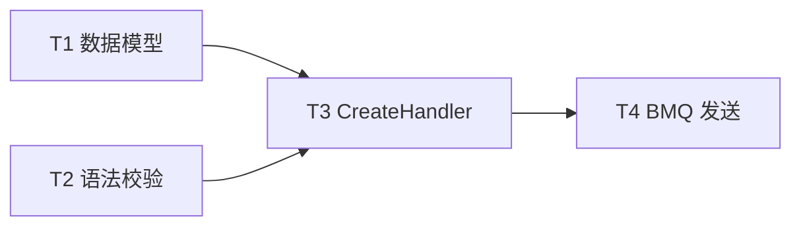
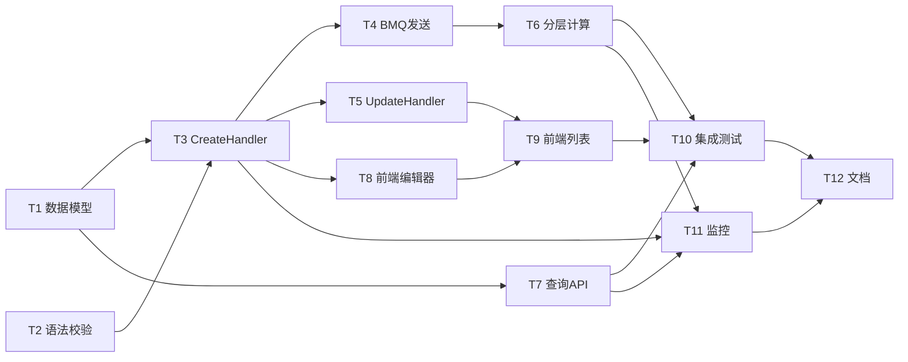

# task.md 模板与粒度判定

> `e2e-solution-design` 的实现任务清单模板。本文件提供：模板骨架 + 中等粒度规则 + 完整示例 + 粒度自审 Checklist。

---

## 核心原则

task.md 是**活文档**。本 skill **初始化**它，之后：
- Sub-Agent 执行完一个任务 → 主 Agent（`e2e-code-review-loop`）回写 `[ ]` → `[x]`
- 进度汇总会被主 Agent 更新

**不要**让 Sub-Agent 自己改 task.md（避免并发冲突）。

---

## 中等粒度规则

### 定义

每个任务 **2-8 小时**工作量，对应 **1 个自然的代码提交**。

### 判定方法

拆完后逐条自问：

- **< 2 小时**：太细 → **合并**相邻任务
  - 例：`新增 struct` + `新增 struct 的 JSON tag` → 合并
- **2-8 小时**：刚好 → 保留
- **8-16 小时**：偏粗但可接受 → 若能自然拆则拆，不能则保留
- **> 16 小时**：太粗 → **必须拆**
  - 拆分维度：按功能点、按文件、按接口

### 示例：「实现分层规则保存接口」

**太细**（20 条）：
- ❌ T1 新增 Rule struct
- ❌ T2 给 Rule 加 ID 字段
- ❌ T3 给 Rule 加 Name 字段
- ❌ T4 实现 Rule.Validate 方法的 nil 检查
- ❌ ...

**太粗**（1 条）：
- ❌ T1 实现规则保存功能（16 小时）

**刚好**（4 条，中等粒度）：
- ✅ T1 实现 Rule 数据模型和 DAO（4h）
- ✅ T2 实现规则语法校验（RPN 解析器）（6h）
- ✅ T3 实现 CreateRule Handler + 路由注册（3h）
- ✅ T4 实现 BMQ 消息发送（规则变更）（3h）

---

## 模板骨架

```markdown
# 实现任务清单 · [需求名称]

> **来源 Plan**：./plan.md
> **关联验证**：./verification.md
> **任务总数**：N
> **预估总工时**：X 小时
> **最后更新**：[日期]

---

## 进度汇总

| 状态 | 数量 |
|---|---|
| ✅ 已完成 | 0 / N |
| 🔄 进行中 | 0 |
| ⏸️ 等待依赖 | 0 |
| 📋 待开始 | N |

> Checkbox 由 `e2e-code-review-loop` 主 Agent 集中回写，Sub-Agent 不直接修改本文件。

---

## 任务列表

### T1：[任务标题]
- [ ] **状态**：pending
- **依赖**：无
- **预估**：4 小时
- **仓库/PSM**：user.segment.api
- **涉及文件**：
  - `dao/segment_rule_dao.go`（新建）
  - `model/segment_rule.go`（新建）
- **关联 Plan 章节**：plan.md § 4.1
- **关联验收**：verification.md § 2（单测验证）
- **任务描述**：
  实现 Rule 数据模型和 DAO 层。Rule 字段按 plan.md § 4.1 的数据模型章节定义。
  DAO 需支持 CRUD 4 个方法，接口签名参考现有 `dao/user_dao.go` 的风格。
  使用公司 ORM `bytedance-gorm`，数据库连接从 config 读取。
- **验收**：
  - [ ] DAO 单测覆盖率 ≥ 80%
  - [ ] 能通过 `go build ./...`
  - [ ] Code review 通过

### T2：[任务标题]
- [ ] **状态**：pending
- **依赖**：T1
- **预估**：6 小时
- **仓库/PSM**：user.segment.api
- **涉及文件**：
  - `service/rule_validator.go`（新建）
  - `service/rpn_parser.go`（参考 segment.common/rpn，移植后 customize）
- **关联 Plan 章节**：plan.md § 3.1, § 4.1
- **关联验收**：verification.md § 2
- **任务描述**：
  实现 RPN 表达式的语法校验器。
  参考 `segment.common/rpn/parser.go`（已有库）的实现方式。
  关键：错误时要返回行号 + 列号（例："line 3, col 12: unexpected token"）。
  本任务只做校验，不涉及规则执行。
- **验收**：
  - [ ] 5 个典型合法表达式能通过
  - [ ] 5 个典型非法表达式能返回准确行列
  - [ ] 覆盖率 ≥ 90%

### T[N]：...

---

## 任务依赖图（可选，任务数 > 10 时建议画）



---

## 备注

- 任务按**拓扑序**排列（依赖前置的排在前）
- 同层任务可并行执行
- 任何任务若在 Sub-Agent 执行时发现**上下文不足**，返回 `NEEDS_CONTEXT`，主 Agent 会补充后重派
```

---

## 任务字段详解

### 依赖

格式：
- `无` —— 无前置依赖
- `T1` —— 依赖 T1 完成
- `T1, T2` —— 依赖多个

**循环依赖会在自审时报错**。

### 预估

**保守估计**。遵循：
- 明显很快（< 1h）→ 写 "1h"（最小单位）
- 常规任务 → 按 2/4/6/8 小时档位
- 不确定（新技术/未知代码）→ 多加 50% buffer

### 涉及文件

**必须精确到文件路径**。格式：
- `新建`：`handler/segment_handler.go（新建）`
- `修改`：`service/existing_service.go（修改）`
- `参考`：`common/rpn/parser.go（参考，不改）`

### 关联 Plan 章节

用 `plan.md § X.Y` 格式引用 plan.md 的具体章节。
**每个任务必须至少关联 1 个 Plan 章节**，否则说明 Plan 没覆盖到或任务多余。

### 关联验收

用 `verification.md § N` 格式引用。
**每个任务必须至少关联 1 个 verification 章节**。

### 任务描述

**必填字段**（让 Sub-Agent 能独立执行）：
- 要实现什么（功能点）
- 参考什么（已有代码路径 / 接口定义 / 文档链接）
- 关键约束（命名规范 / 依赖库 / 性能要求）

**不写的内容**：
- 抽象的业务背景（看 plan.md）
- 详细的架构说明（看 plan.md）

### 验收

**可测**的完成标准。至少 2 条，建议 3-5 条。

示例好坏：
- ❌ "实现完成"（不可测）
- ❌ "代码质量好"（主观）
- ✅ "单测覆盖率 ≥ 80%"
- ✅ "P99 ≤ 200ms（pressure test 1K QPS）"
- ✅ "通过 code review，Reviewer：@leader"

---

## 完整示例：「用户分层规则自助配置」

```markdown
# 实现任务清单 · 用户分层规则自助配置

> **来源 Plan**：./plan.md
> **关联验证**：./verification.md
> **任务总数**：12
> **预估总工时**：52 小时 (~6.5 人日)
> **最后更新**：2026-04-22

---

## 进度汇总

| 状态 | 数量 |
|---|---|
| ✅ 已完成 | 0 / 12 |
| 🔄 进行中 | 0 |
| ⏸️ 等待依赖 | 0 |
| 📋 待开始 | 12 |

---

## 任务列表

### T1：实现 Rule 数据模型和 DAO
- [ ] **状态**：pending
- **依赖**：无
- **预估**：4 小时
- **仓库/PSM**：user.segment.api
- **涉及文件**：
  - `model/segment_rule.go`（新建）
  - `dao/segment_rule_dao.go`（新建）
  - `migrations/20260422_add_segment_rules.sql`（新建）
- **关联 Plan 章节**：plan.md § 4.1
- **关联验收**：verification.md § 2
- **任务描述**：
  按 plan.md § 4.1 数据模型章节定义 Rule struct 和对应的 DB schema。
  DAO 需支持 Create/Update/Delete/ListByEnabled/GetByID 5 个方法。
  接口签名参考同仓库 `dao/user_dao.go` 的风格。
  使用 `bytedance-gorm`，DB 连接从 `config.DB` 读取。
- **验收**：
  - [ ] DB migration 能 apply
  - [ ] DAO 单测覆盖率 ≥ 80%
  - [ ] 通过 go lint

### T2：实现 RPN 表达式语法校验
- [ ] **状态**：pending
- **依赖**：无（可与 T1 并行）
- **预估**：6 小时
- **仓库/PSM**：user.segment.api
- **涉及文件**：
  - `service/rule_validator.go`（新建）
  - `service/rpn_parser.go`（从 segment.common 移植 + customize）
- **关联 Plan 章节**：plan.md § 3.1, § 4.1
- **关联验收**：verification.md § 2
- **任务描述**：
  移植 `segment.common/rpn/parser.go`（已有）到本仓库。
  customize 点：错误信息要包含行号 + 列号（格式："line N, col M: <message>"）。
  只做语法校验，不执行规则。
  常见表达式示例：`user.age >= 18 && user.level == 'gold'`
- **验收**：
  - [ ] 5 个合法表达式通过（见测试 fixture）
  - [ ] 5 个非法表达式返回准确行列
  - [ ] 覆盖率 ≥ 90%

### T3：实现 CreateRule Handler
- [ ] **状态**：pending
- **依赖**：T1, T2
- **预估**：3 小时
- **仓库/PSM**：user.segment.api
- **涉及文件**：
  - `handler/segment_rule_handler.go`（新建）
  - `router/router.go`（修改，注册新路由）
- **关联 Plan 章节**：plan.md § 4.1
- **关联验收**：verification.md § 2, § 3
- **任务描述**：
  实现 POST /api/v1/segment-rules endpoint。
  请求体：{name, expression, segment_name, priority}。
  流程：参数校验 → 调 RuleValidator 校验语法 → DAO Create → 发 BMQ → 返回 Rule。
  参考 `handler/user_handler.go` 的风格和中间件使用方式。
  需要 admin 权限（用 `middleware.RequireAdmin`）。
- **验收**：
  - [ ] 5 个典型请求能通过
  - [ ] 非法表达式返回 400 + 错误详情
  - [ ] 权限不足返回 403
  - [ ] 集成测试覆盖主路径

### T4：实现 BMQ 规则变更消息发送
- [ ] **状态**：pending
- **依赖**：T3
- **预估**：3 小时
- **仓库/PSM**：user.segment.api
- **涉及文件**：
  - `service/rule_event_publisher.go`（新建）
  - `handler/segment_rule_handler.go`（修改）
- **关联 Plan 章节**：plan.md § 4.1
- **关联验收**：verification.md § 2
- **任务描述**：
  规则 CUD 操作成功后，发 BMQ 消息到 topic `segment_rule_changes`。
  消息格式：{rule_id, action, timestamp}。
  用 `bytedance-bmq` SDK，配置从 config 读。
  发送失败不阻塞主流程（降级策略：记 error log + 手动重试队列）。
- **验收**：
  - [ ] BMQ 消息能正确发送
  - [ ] 发送失败时不影响 API 响应
  - [ ] 单测覆盖

### T5：实现 Update/Delete/List Rule Handlers
- [ ] **状态**：pending
- **依赖**：T3
- **预估**：4 小时
- **仓库/PSM**：user.segment.api
- **涉及文件**：
  - `handler/segment_rule_handler.go`（修改）
  - `router/router.go`（修改）
- **关联 Plan 章节**：plan.md § 4.1
- **关联验收**：verification.md § 2
- **任务描述**：
  补全 PUT/DELETE/GET 三个 endpoint。
  DELETE 是软删除（set enabled=false + deleted_at=now()）。
  GET list 支持分页（page, page_size）和过滤（enabled）。
- **验收**：
  - [ ] 三个 endpoint 主路径单测通过
  - [ ] 软删除后 List 默认不返回已删除项

### T6：实现分层计算服务（消费者）
- [ ] **状态**：pending
- **依赖**：T4
- **预估**：8 小时
- **仓库/PSM**：segment.calculator.service
- **涉及文件**：
  - `consumer/rule_change_consumer.go`（新建）
  - `service/batch_calculator.go`（新建）
- **关联 Plan 章节**：plan.md § 4.2
- **关联验收**：verification.md § 2, § 3
- **任务描述**：
  消费 `segment_rule_changes` 消息，触发全量分层重算。
  计算流程：
    1. 加载所有 Enabled 规则（按 Priority 升序）
    2. 分批拉取用户（10K/批）
    3. 每批调用 user.profile.api 拿属性
    4. 逐条匹配规则（命中即止）
    5. 批量写 Redis（pipeline）
  性能目标：1M 用户 ≤ 10 分钟。
  参考 `batch_processor.go`（已有的批量处理框架）。
- **验收**：
  - [ ] 功能测试：10K 用户场景下正确率 100%
  - [ ] 性能测试：本地环境 10K 用户 ≤ 6 秒
  - [ ] 单测覆盖核心逻辑

### T7：实现分层查询 API
- [ ] **状态**：pending
- **依赖**：T1
- **预估**：3 小时
- **仓库/PSM**：user.segment.api
- **涉及文件**：
  - `handler/segment_query_handler.go`（新建）
- **关联 Plan 章节**：plan.md § 4.1
- **关联验收**：verification.md § 2, § 4
- **任务描述**：
  实现 GET /api/v1/users/:user_id/segment endpoint。
  从 Redis 读取用户分层结果，miss 时返回默认分层。
  QPS 目标：500，P99 ≤ 50ms。
- **验收**：
  - [ ] 主路径单测
  - [ ] 压测 500 QPS 持续 5 分钟 P99 ≤ 50ms

### T8：运营后台前端 - 规则编辑器
- [ ] **状态**：pending
- **依赖**：T3（后端 API 就绪）
- **预估**：6 小时
- **仓库/PSM**：operation-platform-web
- **涉及文件**：
  - `src/pages/segment/RuleEditor.tsx`（新建）
  - `src/components/RPNHighlighter.tsx`（新建）
- **关联 Plan 章节**：plan.md § 4.3
- **关联验收**：verification.md § 3
- **任务描述**：
  用 CodeMirror 实现 RPN 表达式编辑器。
  需求：语法高亮 + 错误行标记 + 保存前校验。
  错误标记需要展示具体行号列号（后端返回的信息）。
  UI 风格对齐现有 Ant Design Pro。
- **验收**：
  - [ ] 能输入合法表达式并保存
  - [ ] 非法表达式展示错误行（高亮 + 错误提示）

### T9：运营后台前端 - 规则列表页
- [ ] **状态**：pending
- **依赖**：T5, T8
- **预估**：5 小时
- **仓库/PSM**：operation-platform-web
- **涉及文件**：
  - `src/pages/segment/RuleList.tsx`（新建）
- **关联 Plan 章节**：plan.md § 4.3
- **关联验收**：verification.md § 3
- **任务描述**：
  列表页展示所有规则，支持启用/禁用、编辑、删除、分页、搜索。
  用 Ant Design Pro 的 ProTable。
  权限控制：非 admin 看不到"删除"按钮。
- **验收**：
  - [ ] 主路径 E2E 测试通过

### T10：集成测试套件
- [ ] **状态**：pending
- **依赖**：T1-T9 全部完成
- **预估**：4 小时
- **仓库/PSM**：user.segment.api
- **涉及文件**：
  - `tests/integration/segment_e2e_test.go`（新建）
- **关联 Plan 章节**：plan.md § 全
- **关联验收**：verification.md § 3
- **任务描述**：
  E2E 测试覆盖：规则保存 → BMQ → 计算 → 查询 的完整链路。
  使用 testcontainers 起 MySQL + Redis + BMQ 桩。
- **验收**：
  - [ ] 至少 5 个端到端场景测试通过
  - [ ] CI pipeline 能跑通

### T11：监控告警配置
- [ ] **状态**：pending
- **依赖**：T3, T6, T7
- **预估**：3 小时
- **仓库/PSM**：user.segment.api, segment.calculator.service
- **涉及文件**：
  - 字节监控平台配置（无代码改动）
- **关联 Plan 章节**：plan.md § 6
- **关联验收**：verification.md § 4
- **任务描述**：
  配置三个告警：
    1. API 错误率 > 1%，持续 3 分钟 → P1
    2. 分层变更量 > 10%（可能是规则错误）→ P1
    3. 全量重算失败 → P0
  告警渠道：飞书机器人 + 电话（P0）。
- **验收**：
  - [ ] 3 个告警在监控平台已创建
  - [ ] 主动触发测试（注入一次异常，验证告警生效）

### T12：文档和 README
- [ ] **状态**：pending
- **依赖**：T1-T11
- **预估**：3 小时
- **仓库/PSM**：user.segment.api
- **涉及文件**：
  - `README.md`（修改）
  - `docs/segment-rules.md`（新建）
- **关联 Plan 章节**：plan.md § 全
- **关联验收**：verification.md § 5
- **任务描述**：
  更新 README 说明新能力。
  写一份运营使用手册（含 RPN 语法速查）。
- **验收**：
  - [ ] README 包含新功能入口
  - [ ] 运营手册 review 通过（@运营 Leader）

---

## 任务依赖图


```

---

## 粒度自审 Checklist

task.md HARD-GATE 前必过：

### 粒度（5 项）

- [ ] 所有任务预估都在 2-8 小时（个别 8-12 可接受，> 16 必须拆）
- [ ] 没有"拆得太碎"（比如"新增 1 个字段"独立成任务）
- [ ] 没有"拆得太粗"（单任务 > 16h 的必须拆）
- [ ] 总任务数 < 20（MVP 阶段，否则建议分阶段交付）
- [ ] 每任务都对应**1 个自然的 Git commit**

### 完整性（5 项）

- [ ] 每任务都有 **依赖 / 预估 / 仓库 / 文件 / Plan 章节 / 验收**（6 个必填字段）
- [ ] 每任务都关联至少 1 个 Plan 章节
- [ ] 每任务都关联至少 1 个 verification 章节
- [ ] 涉及文件字段精确到**路径**（不是"相关文件"）
- [ ] 验收标准**可测**（不是"完成"、"质量好"）

### 依赖关系（3 项）

- [ ] 无循环依赖
- [ ] 任务按**拓扑序**排列（前置在前）
- [ ] 任务数 > 10 时画了依赖图

### 反 AI-slop（2 项）

- [ ] 任务描述**具体**（文件路径 + 接口签名 + 参考代码）
- [ ] 任务标题**动宾结构**（"实现 XX"，不是"XX 模块"）

---

## Sub-Agent 执行约定

`e2e-code-review-loop` 会把每个任务条目作为**任务包**派发给 Sub-Agent。

Sub-Agent 看到任务包后：

1. **读**任务描述 + 关联 Plan 章节 + 关联 verification
2. **执行**代码改动
3. 根据**验收标准**自检
4. 返回四态之一（DONE / DONE_WITH_CONCERNS / BLOCKED / NEEDS_CONTEXT）
5. **不修改 task.md**（主 Agent 代劳）

---

*本模板基于 Spec Kit tasks.md + Kiro tasks.md 综合，粒度规则参考 BMAD story file 实践。*
