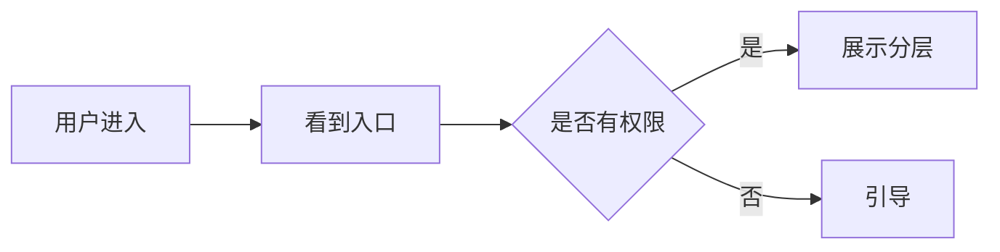

# PRD Generation —— PRD 生成

## 本 skill 的绝对前置条件

**不要在需求未澄清时写 PRD**。这是本 skill 的第一硬约束。

进入本 skill 前，必须满足：

- [x] `adversarial-qa` 已触发 HARD-GATE "核心需求稳定"
- [x] `requirement-clarification` 已产出 MoSCoW 清单 + 边界 + 验收标准

如果其中任一缺失，**拒绝直接写 PRD**，明确告知用户：

```
❌ 检测到需求澄清不完整：
- [列出缺失的部分]

我需要先调用 [缺失的前置 skill] 补完，然后再写 PRD。
否则 PRD 写出来会是空壳，浪费你的时间。

现在回退到 [前置 skill] 继续？
```

**例外**：只有用户明确说"我知道不完整，我就要先看个草稿"，才跳过此约束。跳过后产出的 PRD 要明确标记"草稿 v0.1 - 需求未完全澄清"。

---

## 三阶段工作流

本 skill 借鉴 anthropics/skills 的 `doc-coauthoring` 三阶段设计：

```
┌─────────────────────────────────────────┐
│  阶段 1：Gather（聚合）                  │
│  把前置 skill 的输出整合为"素材集"       │
│  不写 PRD，只组织材料                    │
└─────────────────┬───────────────────────┘
                  ▼
┌─────────────────────────────────────────┐
│  阶段 2：Refine（精炼）                  │
│  基于素材集撰写 PRD 草稿                 │
│  自我审查：矛盾、空话、缺项              │
└─────────────────┬───────────────────────┘
                  ▼
┌─────────────────────────────────────────┐
│  阶段 3：Reader-Test（读者测试）         │
│  让用户扮演"读者"通读，挑出问题          │
│  迭代到用户确认                           │
└─────────────────────────────────────────┘
```

---

## 阶段 1：Gather（聚合）

### 目的

把前置 skill 的散落产出，按 PRD 结构**预组织**。

### 动作

1. 回顾对话历史，提取以下素材：
   - `adversarial-qa` 阶段确认的"不做的代价"、"用户画像"
   - `requirement-clarification` 的 MoSCoW 清单
   - `requirement-clarification` 的边界定义
   - `requirement-clarification` 的验收标准
   - 对话中提到的任何**关键数据、竞品、约束**

2. 按 PRD 章节**预分配**素材：

```markdown
## 素材分配表

### 一句话说明 → 从 adversarial-qa 的"核心需求"提炼
### 为什么做 → 从"不做的代价" + "价值假设"
### 做什么 → MoSCoW 的 Must/Should/Could
### 不做什么 → MoSCoW 的 Won't + 边界定义
### 验收标准 → requirement-clarification 的验收标准
### 风险与依赖 → 对话中提到的顾虑点
```

1. 如果发现某个章节**素材空缺**，停下来问用户或回退到前置 skill。

### Gather 阶段产出物

**不是 PRD**，是一份**素材分配清单**。格式：

```markdown
# PRD 素材清单 v0（内部草稿，不对外）

## 一句话说明
[从对话中摘录]

## 核心素材
- 用户画像：[摘录]
- 量级：[摘录]
- 不做的代价：[摘录]

## MoSCoW
[直接复用 requirement-clarification 的输出]

## 边界
[直接复用]

## 验收标准
[直接复用]

## 缺失的素材（需要补充）
- ❓ [待确认的点]
- ❓ [待确认的点]
```

**如果"缺失的素材"非空**，stop and ask。

---

## 阶段 2：Refine（精炼）

### 目的

基于 Gather 的素材清单，撰写 PRD 草稿。

### PRD 标准结构

```markdown
# [需求名称]

> **状态**：草稿 / 评审中 / 已定稿
> **作者**：[用户]
> **最后更新**：[日期]
> **审阅人**：[待填]

---

## 一句话说明

[一句话讲清楚做什么。不超过 30 字。]

---

## 为什么做（Why）

### 业务价值
[定量描述：解决了什么问题？带来什么业务收益？]

### 用户痛点
[定性描述：用户当前怎么没有这个功能活下来的？有多痛？]

### 不做的代价
[如果不做，失去什么？]

### 价值假设（可证伪）
- **假设**：做了 X，会让指标 Y 提升 Z%
- **验证方式**：[A/B 测试 / 指标对比 / 用户访谈]
- **失败定义**：如果上线 N 周后 Y 没有提升 Z% 的 70%，判定项目失败

---

## 做什么（What）

### 核心能力（Must）
- **[M1]** [具体能力，主语动词宾语清晰]
- **[M2]** ...

### 增强能力（Should）
- **[S1]** ...

### 可选能力（Could）
- **[C1]** ...

### 用户流程
[用 mermaid 或文字描述主流程]



---

## 不做什么（Out of Scope）

明确**不**做的场景清单：

- ❌ **[场景]**：不做的原因
- ❌ **[场景]**：不做的原因

> 以上场景如用户反馈强烈，留待 v1.1+ 讨论。

---

## 怎么做（How - 方案概要）

> **注**：本章节为方案方向性描述，详细技术设计见 [后续的方案设计文档]。

### 技术方向

[高层方案描述，不要写具体代码]

### 涉及模块 / 系统

- 前端：[...]
- 后端：[...]
- 数据：[...]

### 关键技术选型

- [选型 1]：理由
- [选型 2]：理由

---

## 验收标准

### 功能验收

- [ ] [Given-When-Then]
- [ ] ...

### 性能验收

- [ ] P99 ≤ Xms
- [ ] 支持 Y QPS

### 安全验收

- [ ] [具体条目]

### 数据验收

- [ ] 核心指标 [指标] 在 [时间窗] 内达到 [数值]

---

## 风险与依赖

### 风险

| 风险 | 可能性 | 影响 | 应对 |
|---|---|---|---|
| [风险描述] | 高/中/低 | 高/中/低 | [预案] |

### 依赖

- **上游**：[哪些系统/团队的产出是前置条件]
- **下游**：[哪些系统/团队会被影响]
- **关键人**：[决策人、审批人]

---

## 发布计划

### 里程碑

- [ ] **M1**：技术方案 review 通过（预计 日期）
- [ ] **M2**：开发完成（预计 日期）
- [ ] **M3**：BOE 联调通过（预计 日期）
- [ ] **M4**：PPE 灰度上线（预计 日期）
- [ ] **M5**：100% 全量（预计 日期）

### 灰度策略

[描述灰度节奏：1% → 10% → 50% → 100%，每阶段的观测标准]

### 回滚方案

[描述回滚方式和触发条件]

---

## 开放问题

> 本章节列出 PRD 评审时需要决策的开放问题。

- ❓ **[问题 1]**：[背景] / [候选方案]
- ❓ **[问题 2]**：...

---

## 附录

- [相关飞书文档链接]
- [相关代码库]
- [关键数据报表]

```

### 撰写原则

#### 决策文档风格，不是报告文档

**禁止**："本项目旨在通过构建用户分层运营能力，实现运营效率的全面提升，助力业务增长。"

**正确**："做分层运营能让运营同学从 4 小时的 Excel 变成 15 分钟的配置。不做，每月浪费 2 人日。"

#### 每句都要有信息量

删掉任何**不是在传递信息**的句子：
- ❌ "众所周知..."
- ❌ "值得一提的是..."
- ❌ "在当前环境下..."
- ❌ "为了更好地..."

#### 可证伪的假设

**禁止**："这个功能会极大提升用户体验。"

**正确**："这个功能会让 30 天留存提升 2 个百分点。如果上线 8 周后留存没有提升 1.4 个百分点，视为失败。"

#### 拒绝"事后诸葛亮"式描述

PRD 是**写给未来的团队成员看的**。他要能回答：
- 为什么当时做这个决策？
- 当时考虑过什么替代方案？为什么没选？
- 哪些是明确的 trade-off？

---

## Refine 阶段自我审查 Checklist

PRD 草稿写完后，**自动**检查以下 15 项：

### 完整性检查
- [ ] 每个章节都有实质内容（不是空标题）
- [ ] Must 数量 ≤ 10 条
- [ ] Won't 数量 ≥ 3 条（明确列出不做什么）
- [ ] 验收标准覆盖 5 类（功能/异常/性能/安全/数据）
- [ ] 风险至少列了 3 条
- [ ] 依赖至少列了 1 项上游 + 1 项下游

### 质量检查
- [ ] 一句话说明 ≤ 30 字
- [ ] 价值假设是**可证伪**的（有数字、有时间窗、有失败定义）
- [ ] 每条 Must 都是**动宾结构**（"谁能做什么"）
- [ ] 灰度策略具体到**百分比和时间**

### 反 AI-slop 检查
- [ ] 没有"总的来说"、"综上所述"等水话
- [ ] 没有空话套路（"全面提升"、"赋能"、"打通"、"闭环"）
- [ ] 没有无信息量的 bullet（每条都在传递具体信息）
- [ ] 没有"本项目旨在..."这种报告体

### 矛盾检查
- [ ] Must 和 Won't 没有矛盾（同一能力不能同时出现在两处）
- [ ] 验收标准和 Must 一致（Must 中的每条都有对应验收）
- [ ] 风险和依赖覆盖了已知的坑

**任何一项不过 → 修改后重检**。

---

## 阶段 3：Reader-Test（读者测试）

### 目的

发给用户**通读**，让他扮演"PRD 读者"找问题。

### 动作

```

1. Agent 展示完整 PRD Markdown
2. Agent 主动询问 3 个视角的问题（不能一次都问）：

  视角 A：工程师视角
  "如果你是第一次看这个 PRD 的工程师，你能一次看懂要做什么吗？
   有哪些地方你会追问？"

  视角 B：评审者视角
  "如果这个 PRD 放到评审会上，你担心哪些部分会被喷？"

  视角 C：6 个月后的你
  "假设 6 个月后你忘记了所有背景，只能靠这份 PRD 理解，
   哪里会让你迷失？"

1. 用户反馈 → Agent 修改 → 再展示 → 再反馈
   直到用户说"没问题了"

```

### Reader-Test 的最多迭代次数

**3 轮**。超过 3 轮仍无法定稿 → 说明需求本身还有问题，回退到 `requirement-clarification`。

---

## HARD-GATE：PRD 定稿

Reader-Test 通过后，触发 HARD-GATE：

```

━━━━━━━━━━━━━━━━━━━━━━━━━━━━━━━
<HARD-GATE>

PRD v1.0 草稿完成。完整 Markdown 如下：

[展示完整 PRD]

这份 PRD 是否定稿？

- ✅ "确认定稿" → 我会保存为 Markdown 文件，进入技术方案阶段
- 📝 "还要改 [...]" → 告诉我要改哪里
- 🔄 "回到需求澄清" → 我会回退到前置 skill

你的选择？
</HARD-GATE>
━━━━━━━━━━━━━━━━━━━━━━━━━━━━━━━

```

用户确认后：

1. 保存为 Markdown 文件到**当前工作目录**
2. 文件名格式：`PRD-[需求简称]-v1.0-[YYYYMMDD].md`
3. 在话题里**再次展示完整 PRD**（方便用户复制）
4. 可选：调 `e2e-prd-share` skill 发到飞书话题

---

## 反 AI-slop 规范（PRD 特别强调）

PRD 是 AI-slop 重灾区。以下是**零容忍**的模式：

### 绝对禁用的短语

- "本项目旨在..."
- "综合来看..."
- "总的来说..."
- "值得注意的是..."
- "众所周知..."
- "为了更好地..."
- "全面提升..."
- "赋能业务"
- "打通业务闭环"
- "以用户为中心"
- "数据驱动决策"

### 绝对禁用的结构

- ❌ "一、二、三、四、五" 用数字堆积章节
- ❌ 每个章节开头都用一句总结（"本章主要讲..."）
- ❌ 用四字成语（"精益求精"、"匠心独运"）
- ❌ 把 bullet point 凑齐 5 条哪怕最后 2 条是水货

### 正确的 PRD 调性

- **像工程师写给工程师**：直接、具体、数字化
- **像律师写合同**：边界清楚、无歧义、不留漏洞
- **像投资人写尽调**：假设可证伪、风险可量化

---

## 特殊情况

### 情况 1：小需求（半天以内的改动）

不要产出标准 PRD，产出**轻量 PRD**：

```markdown
# [需求名称] - 轻量 PRD

## 一句话
[做什么]

## 做什么 / 不做什么
- ✅ ...
- ❌ ...

## 验收
- [ ] ...

## 风险
[1-2 条]
```

### 情况 2：迭代需求（基于已有功能改进）

PRD 必须说明：

- 和 v1 的差异（diff 视角）
- 兼容性（老用户/老数据）
- 迁移方案

### 情况 3：探索性需求（还在试水）

PRD 标记为"**探索性 PRD**"，特点：

- 验收标准换成"探索问题"（例："我们要验证 X 是否成立"）
- 明确 exit criteria（什么时候放弃、什么时候规模化）
- 时间盒限制（N 周内得出结论）

---

## 参考资料

- `references/prd-templates.md` —— 不同类型项目的 PRD 模板
- `references/writing-patterns.md` —— 好 PRD 的写作模式样例

---

## 自检清单（每轮回复前）

- [ ] 当前在哪个阶段（Gather / Refine / Reader-Test）？
- [ ] 阶段 1（Gather）没做好就不要进阶段 2
- [ ] Refine 阶段的 15 项自我审查走过了吗？
- [ ] 有没有触碰到禁用短语？
- [ ] 用户是否明确确认定稿？没确认就不要保存文件

---

*本 skill 设计融合了 Amazon 的 6-pager 理念、MECE 原则、以及 anthropics/doc-coauthoring 的三阶段工作流。*
