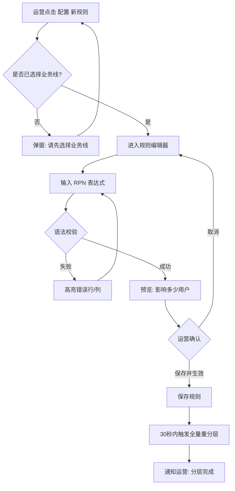

# PRD 写作模式样例库

> **用途**：遇到具体章节不知道怎么写时，查本文件找模式。
> **原则**：所有示例都是**具体的**，不是空话。

---

## 模式 1：一句话说明

### 公式

```
[给谁] 一个 [做什么] 的 [什么形态]，替代 [现有方式]，以 [什么价值]。
```

### 示例

> ✅ **给运营同学**一个**自助配置用户分层规则**的**后台**，替代**手工 Excel 分层**，以**把单次分层时间从 4 小时降到 15 分钟**。
>
> ✅ **给客服同学**一个**快速检索用户订单历史**的**工具**，替代**在 3 个后台系统间来回切换**，以**把用户咨询响应时间从 5 分钟降到 30 秒**。
>
> ✅ **给新用户**一个**三步完成首次购买**的**引导流程**，替代**现有的 7 步注册流程**，以**把新用户首购转化率从 8% 提升到 12%**。

### 反例

> ❌ "本项目主要为了提升用户分层运营的效率和准确性，助力业务精细化增长。"
>
> （问题：没说给谁、做什么、替代什么、具体什么价值）

---

## 模式 2：价值假设（可证伪）

### 公式

```
假设：做了 X，会让指标 Y 在 Z 时间内 提升 N
验证：[A/B 测试 / 指标对比 / 用户访谈]
失败判定：如果 Z 时间内 Y 没有提升 N 的 70%，视为项目失败
```

### 示例

> ✅ **假设**：上线用户分层系统后，运营效率指标（单次分层耗时中位数）在**上线后 4 周内**从 **4 小时**降到 **15 分钟**。
>
> **验证方式**：
> - 统计 10+ 次分层操作的实际耗时
> - 和上线前 4 周的同样操作对比
>
> **失败判定**：如果上线 8 周后，中位数仍高于 **30 分钟**（即未达成目标 70%），视为项目需要迭代，而非成功。

### 反例

> ❌ "通过本功能，将极大提升运营效率，预计效率提升显著。"
>
> （问题：没有数字、没有时间、没有失败定义 → 永远"成功"的项目 = 永远"失败"的项目）

---

## 模式 3：MoSCoW 清单（Must 条目）

### 公式

```
[Mx] [角色] 能 [具体动作] [具体对象]，[约束条件]
```

### 示例

> ✅ **[M1]** 运营同学 能 用 Web UI 配置 分层规则（RPN 表达式），不需要提工单找 RD。
>
> ✅ **[M2]** 系统 能 实时校验 规则语法，错误行号精确到字符，不允许保存有语法错误的规则。
>
> ✅ **[M3]** 运营 能 查看 过去 30 天所有的分层变更历史，包括谁改的、改了什么、何时生效。

### 反例

> ❌ **[M1]** 支持用户分层管理
>
> **问题**：不是主谓宾结构，没说谁做什么，"支持" 可以无限宽泛。

---

## 模式 4：Out of Scope（不做什么）

### 公式

```
❌ [具体场景]：不做的原因是 [原因]，[未来规划或放弃]
```

### 示例

> ✅ **❌ 跨业务线的用户分层**：不做的原因是跨业务用户数据合规评审未完成，目前只支持本业务线用户。v1.1+ 再讨论。
>
> ✅ **❌ 分层规则的 A/B 测试**：不做的原因是现有分层逻辑足够简单，A/B 价值低。如未来规则复杂到需要分组验证，再加。
>
> ✅ **❌ 超过 10 层的分层**：不做的原因是调研发现业务最多用到 5 层。支持 10 层已经留足缓冲。永不做。

### 反例

> ❌ **不做**：其他未提及功能。
>
> **问题**：兜底式描述，没有具体场景，读者无法判断自己的需求是否被覆盖。

---

## 模式 5：用户流程图

### 好的流程图



### 好在哪里

- ✅ 所有分支都画出来（包括错误分支）
- ✅ 节点是具体动作，不是抽象概念
- ✅ 关键判断点用菱形
- ✅ 结束节点明确

### 坏的流程图


**问题**：抽象到没有任何信息量。

---

## 模式 6：风险表

### 公式

| 风险 | 可能性 | 影响 | 应对 | 责任人 |
|---|---|---|---|---|
| [具体风险] | 高/中/低 | 高/中/低 | [预案] | [人] |

### 示例

| 风险 | 可能性 | 影响 | 应对 | 责任人 |
|---|---|---|---|---|
| 分层规则写错，导致大量用户误分层 | 中 | 高 | 上线前灰度 1% 用户验证，加实时分层变更量告警（> 10% 变化即告警） | @张三 |
| 全量重分层性能不达标，影响线上服务 | 中 | 高 | 重分层异步化，限制并发，P99 不受影响；可手动降级到只按请求触发 | @李四 |
| 新分层规则让某业务指标下降 | 高 | 中 | 先灰度 1% → 10%，监控业务指标，3 天无异常再扩大 | @王五 |
| 上游用户画像服务故障 | 低 | 中 | 本地缓存最近一次分层结果 24 小时，画像服务恢复后重新计算 | @张三 |

### 反例

| 风险 | 应对 |
|---|---|
| 技术风险 | 注意代码质量 |
| 业务风险 | 加强沟通 |

**问题**：模糊到无法行动。

---

## 模式 7：验收标准条目

### Given-When-Then 公式

```
### [能力名称]

给定 [明确的前置条件]
当 [明确的触发动作]
则 [明确的预期结果，包括具体数字、具体内容]
```

### 示例

> ✅ **### 分层规则保存**
>
> 给定 运营已登录且有"分层管理"权限
> 当 运营填写完整且语法正确的规则，点击"保存并生效"
> 则 预期：
> - 500ms 内返回保存成功
> - 返回体包含规则 ID、预估影响用户数
> - 30 秒内触发全量重分层任务
> - 在"变更历史"列表里出现新条目

### 反例

> ❌ 分层规则可以保存成功。
>
> **问题**：
> - 没说前置条件
> - 没说"成功"的具体标准
> - 没有时间约束
> - 没有副作用描述

---

## 模式 8：兼容性声明

### 场景：API 版本升级

> ✅ **兼容性声明**：
>
> 新版本 `/api/v2/user/level` 和老版本 `/api/v1/user/level` **并存至少 6 个月**。
>
> - 老版本在此期间**不删除**，继续支持
> - 响应 header 中包含 `X-API-Deprecated: 2026-10-01`，提示调用方迁移
> - 老版本新字段默认值策略：
>   - `user_segment_details`：默认 `null`（老调用方不影响）
>   - `segment_version`：默认 `"v1"`（语义兼容）
> - 6 个月后评估老版本下线，提前 1 个月通过飞书群通知所有调用方

### 场景：数据 schema 变更

> ✅ **数据兼容声明**：
>
> 新 schema 新增字段 `user_level_v2`（BIGINT），不删除老字段 `user_level`（INT）。
>
> - 双写期（前 30 天）：同时写老字段和新字段
> - 双读期（30-60 天）：代码读新字段，老字段保留用于回滚
> - 单字段期（60 天后）：评估后删除老字段
>
> 回滚预案：发现问题时 2 分钟内切回只读老字段。

---

## 模式 9：灰度计划

### 好的灰度计划

```markdown
## 灰度计划

### 阶段 1：内部验证（2 天）
- 范围：本业务线全员（约 50 人）
- 放量方式：按用户 ID hash
- 观测指标：
  - 功能正常率 ≥ 99%
  - P99 响应时间 ≤ 200ms
  - 无 P0/P1 bug
- 通过标准：所有指标达标，且无业务同学投诉
- 负责人：@张三

### 阶段 2：1% 灰度（3 天）
- 范围：随机 1% 线上用户（约 1 万用户）
- 观测指标：
  - 错误率 < 基线 × 1.2
  - 核心业务指标（订单转化率）相对基线偏差 < 2%
- 通过标准：上述指标 72 小时无异常
- 回滚条件：错误率 > 基线 × 2，立即回滚

### 阶段 3：10% 灰度（7 天)
- 范围：随机 10% 用户
- 观测指标：同阶段 2
- 通过标准：核心业务指标达到预期 70%

### 阶段 4：50% 灰度（7 天）
- 范围：随机 50% 用户
- 观测：同上

### 阶段 5：100% 全量
- 触发条件：前阶段所有观测指标无异常
- 完成标记：飞书群同步 + 项目 wiki 更新
```

### 坏的灰度计划

```markdown
先内部测试，然后灰度上线，最后全量。
```

**问题**：没有具体百分比、没有时间、没有观测指标、没有回滚条件。

---

## 模式 10：开放问题（评审前）

### 公式

```
❓ [问题]
- 背景：[为什么这是问题]
- 候选方案：[A / B / C]
- 我倾向：[A，理由]
- 需要决策的人：[Leader / 评审团]
- 决策期限：[日期]
```

### 示例

> ❓ **分层规则的权限范围**
> - **背景**：分层规则影响全业务线用户，权限控制需要谨慎。
> - **候选方案**：
>   - A：任意运营都可编辑规则
>   - B：Leader 审批后才能生效
>   - C：分级权限（简单规则免审批，涉及核心用户群需审批）
> - **我倾向**：C，兼顾效率和安全
> - **需要决策的人**：业务线 Leader
> - **决策期限**：本周五前

---

## 综合反 AI-slop 对照表

| AI-slop 写法 ❌ | 好的写法 ✅ |
|---|---|
| "提升用户体验" | "把首屏加载从 3.2s 降到 1.5s" |
| "赋能业务增长" | "让运营每次分层省 3.75 小时" |
| "打通数据闭环" | "让埋点数据在 5 分钟内能被 BI 看板消费" |
| "体验流畅" | "P99 响应 ≤ 200ms" |
| "业务驱动" | "为支持双十一大促的流量预估 × 3" |
| "全面提升" | "MoSCoW 列出 5 个 Must，3 个 Should" |
| "以用户为中心" | "面向 50 岁以上用户，字号默认 18pt" |
| "数据驱动决策" | "A/B 测试 14 天，样本量 > 10 万，显著性 95%+" |
| "深度思考" | "对比 3 个方案（A/B/C），选 B 的 3 个理由..." |
| "精益求精" | "迭代计划：v1 上线 → 2 周内收集反馈 → v1.1 调整" |

---

## 章节写作顺序建议

第一次写 PRD 时，**按以下顺序**写，效率最高：

1. **Won't Have（不做什么）** —— 先圈边界
2. **一句话说明** —— 逼自己提炼
3. **为什么做** —— 把价值讲明白
4. **Must / Should / Could** —— 展开功能
5. **验收标准** —— 对应每个 Must
6. **风险与依赖** —— 冷静列坑
7. **方案概要** —— 最后补技术方向（因为前面每一步都可能改你的技术选择）
8. **发布计划** —— 有了上述才能排时间
9. **开放问题** —— 标出还没决策的

**不要从"方案"开始写**。从方案开始容易"有锤子找钉子"。

---

*本样例库会随项目迭代持续补充。每次看到好的或坏的 PRD 写法都补进来。*
